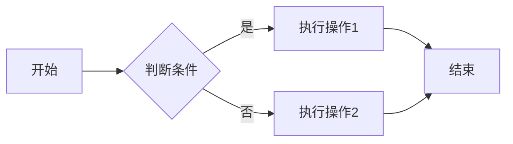
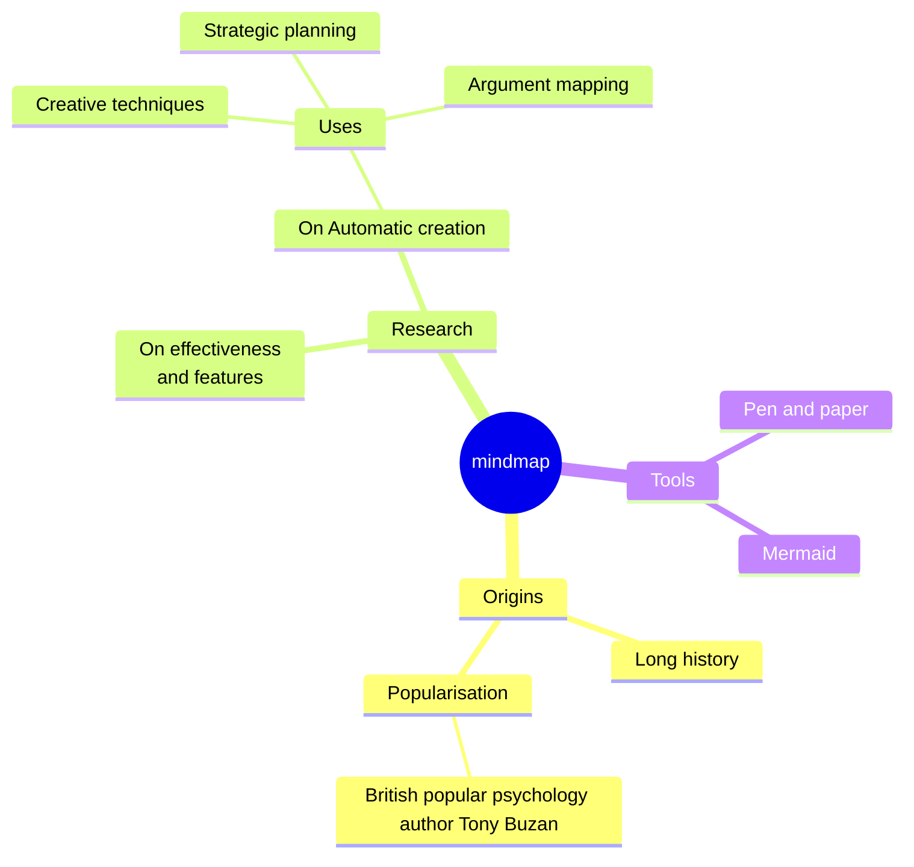
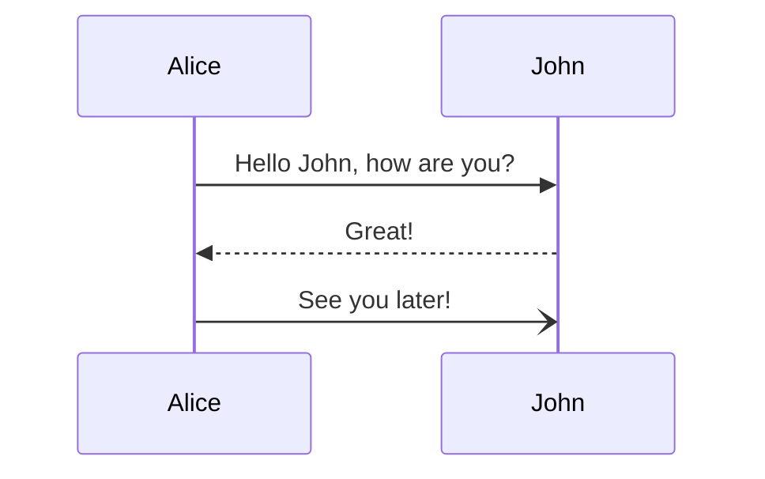
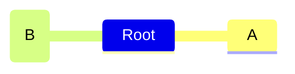
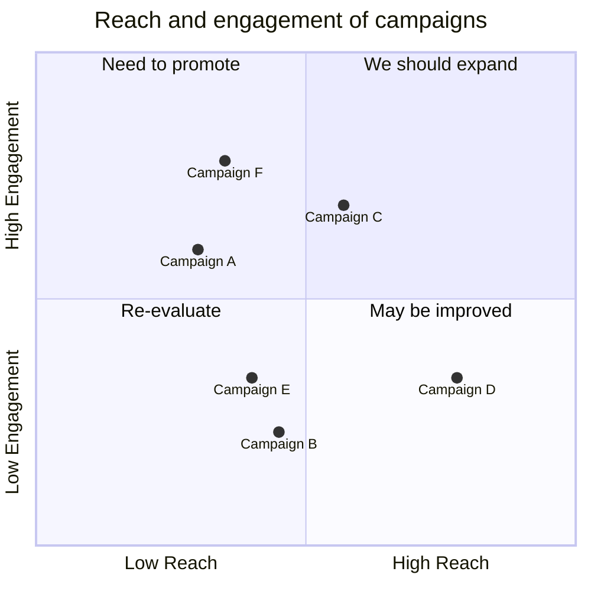

**播客内容介绍** 

**节目名称：** 
<!-- truncate -->

放的财经早班车

**本期嘉宾：** 

None

**主持人：** 

金金军

**节目简介：**

分析小米集团通过先旧后新方式融资53亿美元的原因，解读其对小米股价的影响，以及这笔融资将如何影响小米在电动汽车、人工智能等领域的战略布局。
https://mermaid.nodejs.cn/syntax/sequenceDiagram.html

**播客内容摘要介绍**

本期节目聚焦小米集团近期通过“先旧后新”方式融资高达53亿美元的事件，深入剖析了此次融资的原因、对股价的短期冲击以及长期战略意义。节目从高盛研报提及海外投资者对中国股市兴趣高涨开篇，引出比亚迪销量目标和霸王茶姬赴美IPO的消息，随后重点分析了小米融资事件。节目详细解读了“先旧后新”的配售机制，分析了其对小米股价造成的短期影响，以及对中小股东权益的潜在稀释。同时，节目也深入探讨了小米此次融资的三大主要投向：电动汽车产能扩建、人工智能研发以及优化财务结构，并分析了这些投资对小米未来发展的影响。最后，节目也提到了市场对于小米本次融资战略的信心和疑虑。

**节目大纲**

1. ** 引言 **

   介绍当日财经要闻，包括高盛关于海外投资者对中国股市兴趣的研报、比亚迪的销量目标，以及霸王茶姬赴美IPO的消息。

2. ** 小米融资事件分析 **

   详细解读小米集团通过“先旧后新”方式融资53亿美元的事件，包括：
    * “先旧后新”配售机制的原理和特点。
    * 融资对小米股价的短期冲击。
    * 对中小股东权益的影响。
    * 融资背后的速销逻辑。

3. ** 融资用途与小米战略 **

   深入分析小米此次融资的三大主要投向及其战略意义：
    * 电动汽车产能扩建：解决产能瓶颈，支持销量目标，加速海外扩张。
    * 人工智能研发：加大研发投入，赋能人车家全生态。
    * 优化财务结构：为未来的发展提供更稳健的资金支持。

**内容亮点**: 

* **“先旧后新”融资方式解读：**  

详细解释了小米采用的“先旧后新”配售机制，以及这种融资方式的优势和劣势，特别是对市场和中小股东的影响。

* **小米战略布局深度剖析：**  

深入分析了小米在电动汽车、人工智能等领域的战略布局，以及此次融资对这些战略实现的意义。

---

